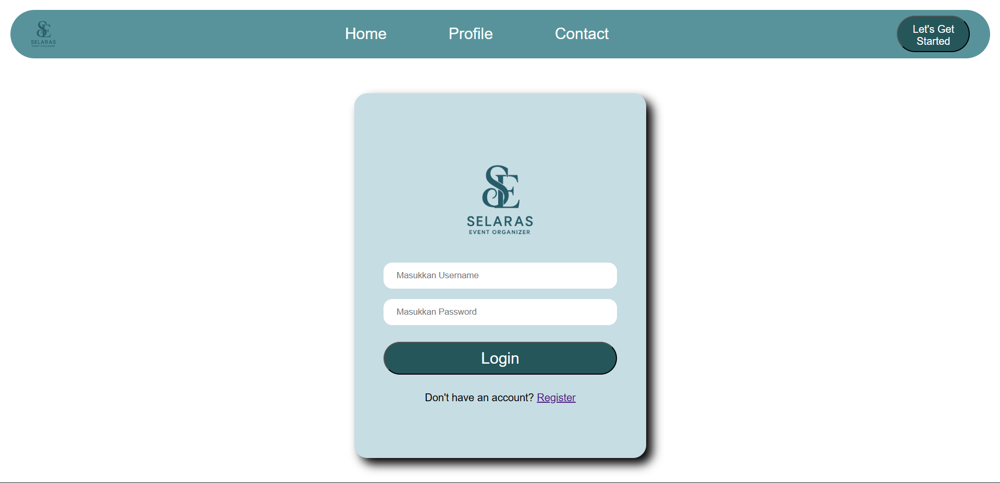
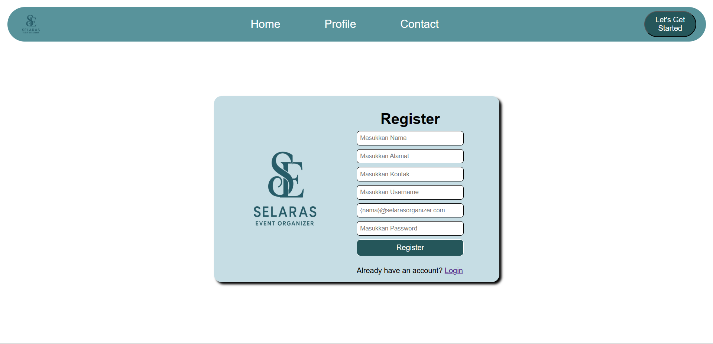
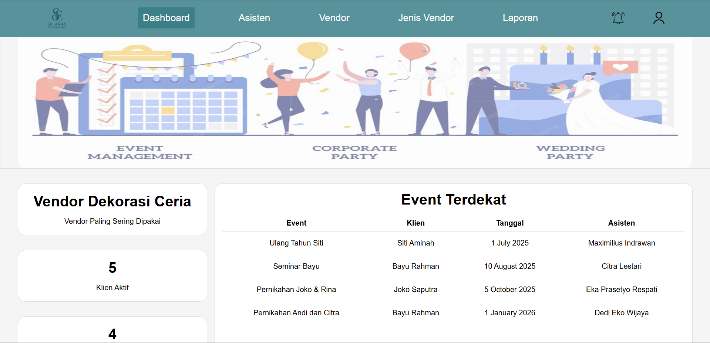

🎉 Event Organizer Management System

📖 Deskripsi Proyek
Event Organizer Management System adalah aplikasi web untuk mengelola operasional usaha event organizer secara terstruktur dan berbasis data. Sistem ini dirancang untuk menangani manajemen klien, event, vendor, serta pencatatan hasil negosiasi harga dengan vendor, lengkap dengan perhitungan estimasi total anggaran event.

Aplikasi ini menerapkan role-based access untuk membedakan hak akses antara pemilik usaha dan asisten, serta menggunakan basis data relasional untuk merepresentasikan alur bisnis nyata pada industri jasa event organizer.

## Tampilan UI

Key Features
- Client, Event, and Vendor Management
- Vendor categorization with price range reference
- Price negotiation (dealing) per event–vendor
- Event budget estimation and breakdown
- Event and vendor collaboration reports
- Role-based access (Owner & Assistant)

🛠️ Tech Stack
- Backend: Java, Spring Boot
- Database: PostgreSQL
- ORM: JPA
- Security: Spring Security
- Frontend: Thymeleaf

What This Project Demonstrates
- Relational database design and implementation
- Business process modeling into a web application
- Many-to-many relationship handling
- Authentication and authorization concepts
- Clean separation between business logic and data layer

📌 Catatan
Sistem ini tidak mencakup proses pembayaran kepada vendor maupun klien. Sistem berfokus pada pencatatan data, negosiasi harga, dan estimasi anggaran event.
